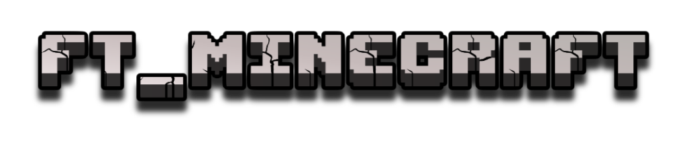
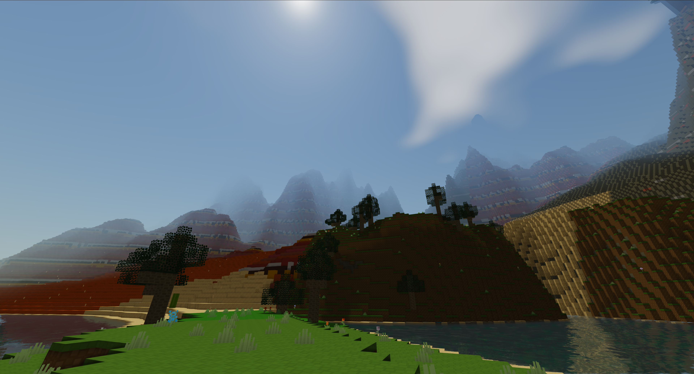
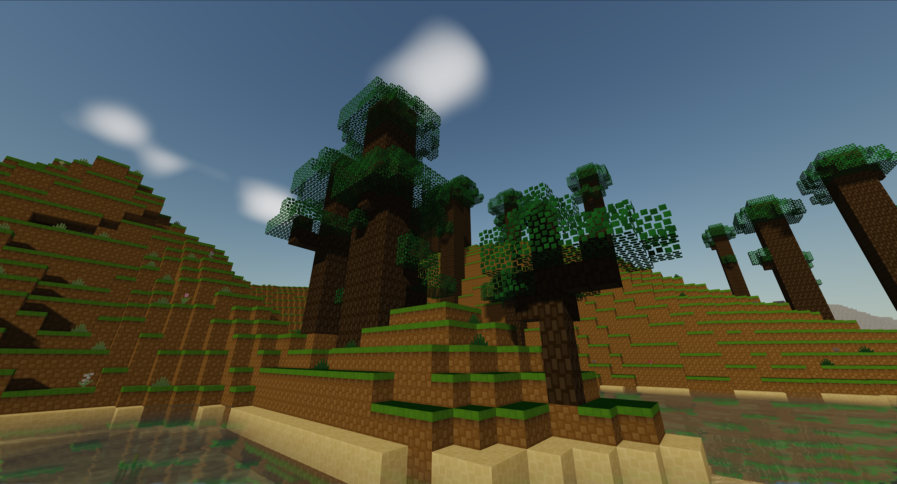
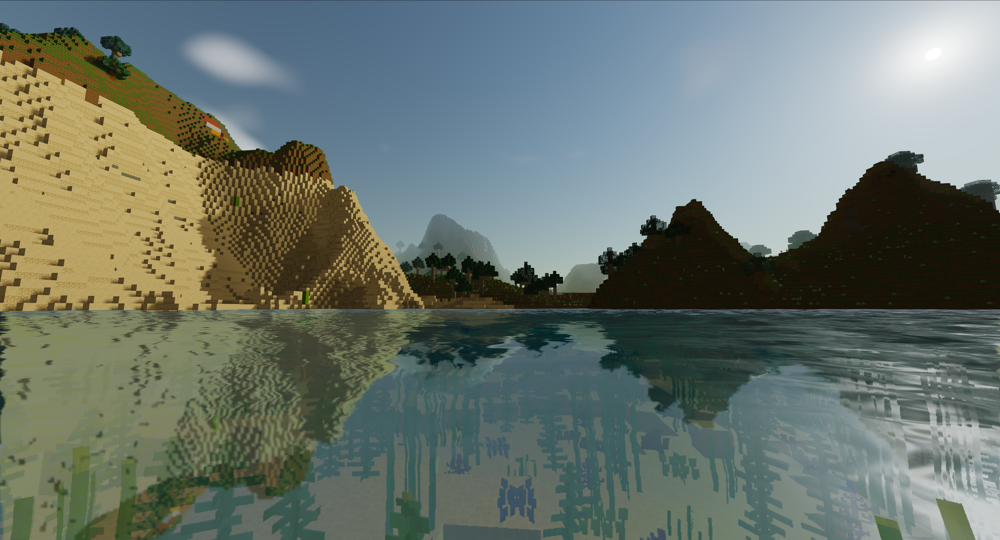
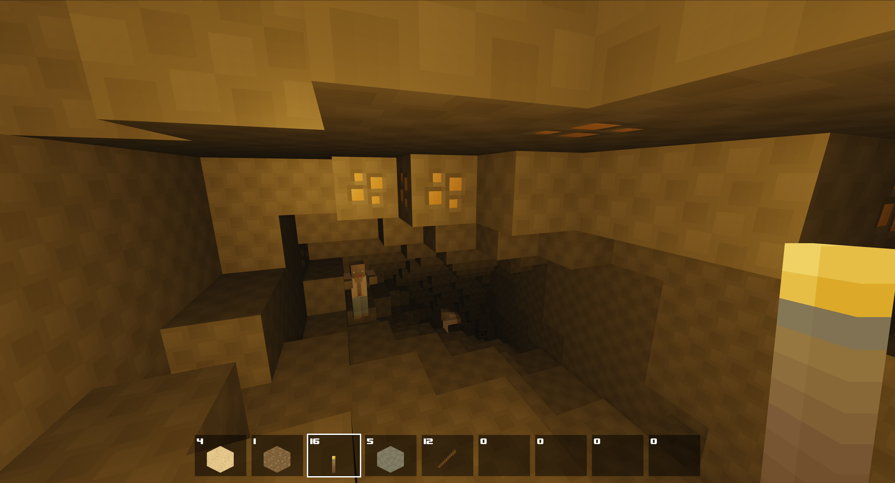
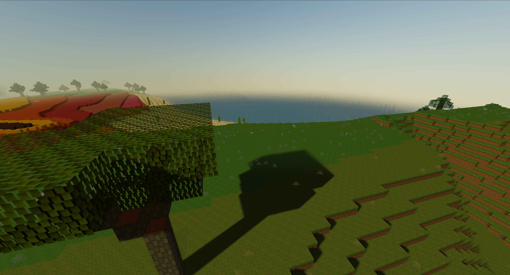
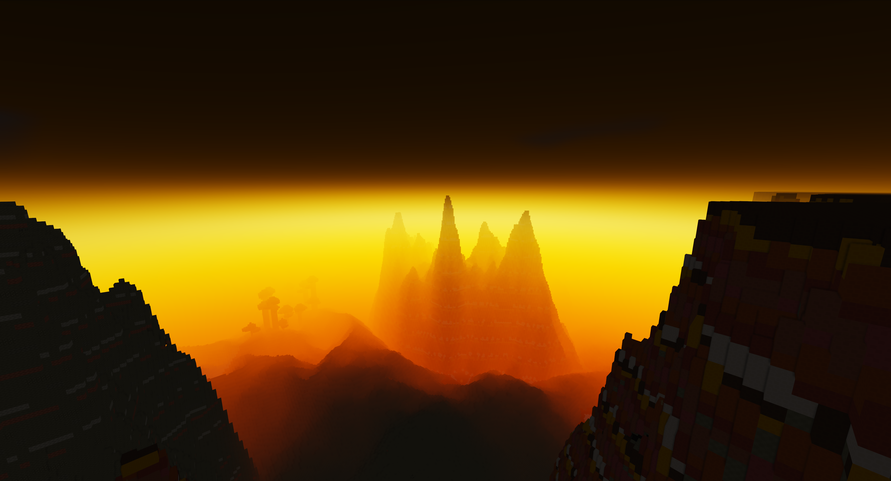
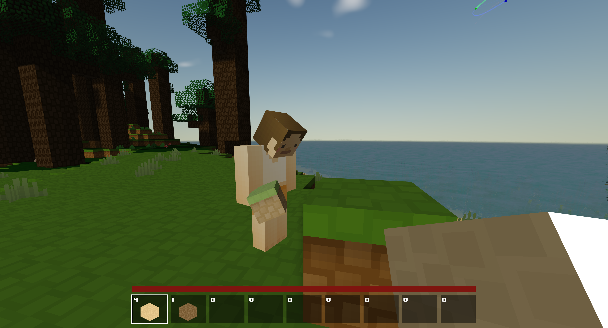
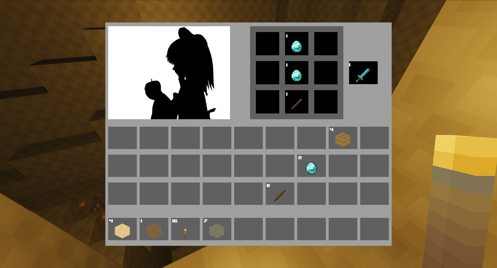

<div align="center">



# ft_minecraft

### *Pimp My World* - a voxel sandbox written from scratch in C++ & OpenGL

[](https://en.cppreference.com/w/cpp/20)
[](https://www.opengl.org/)
[](https://cmake.org/)
[]()
[](LICENSE)

</div>

---

## ✨ Overview

**ft_minecraft** is a from-scratch voxel engine inspired by Minecraft, built as the
follow-up to the *ft_vox* project at 42. The emphasis is on **procedural generation**
and **rendering quality** - building a world that looks good, runs smoothly, and is
fun to explore alone or with friends over the network.

Everything from terrain generation to lighting, shadows and chunk meshing is implemented
by hand. Only thin third-party libraries are used (windowing, image loading, audio
playback, fonts, math).

## 🚀 Features

### 🌍 Procedural world
- **16 biomes** with smooth transitions: Plains, Desert, Red Desert, Dark Forest,
  Birch Forest, Jungle, Savanna, Mesa, Mountain, Tundra, Ice Plains, Swamp,
  Ocean, Mushroom Island, Volcanic, Nether.
- Per-biome geography, elevation, vegetation and color palette.
- Procedurally-generated trees with varying shape, height, width and leaf density.
- Small plants, flowers, tall grass and mushrooms scattered throughout the world.
- Lakes and **meandering rivers** carved across the surface.
- **Realistic water simulation** - dynamic flow and spreading: place a
  water source and the liquid propagates, fills depressions and pours off ledges
  in real time.
- **Worm-style cave systems** with natural cave entrances, and **clustered ores**
  (coal, iron, gold, diamond…).
- **Persistent chunks**: blocks you break or place stay broken/placed across
  unload/reload, and are synchronized in multiplayer.
- Chunks are generated and meshed **on demand** as the player moves - only the
  chunks within view get built, and they're released again when far enough away,
  so the world is effectively infinite without baking it all up-front.
- Navigable over the 5,000,000-block XZ requirement.

### 🎨 Rendering
- Custom OpenGL 4.6 renderer with a deferred-style **G-Buffer**.
- **Directional sun lighting** with **Cascaded Shadow Maps** (CSM) and alpha-tested
  shadow casters for leaves/vegetation.
- **Screen-Space Ambient Occlusion** (SSAO) with blur pass.
- **Volumetric 3D clouds** rendered via a dedicated shader and composited.
- **Procedural sky** with a precomputed **Sky LUT** (atmospheric scattering style).
- **Transparent water** with reflection/refraction framebuffers, DuDv normal-mapped
  waves and underwater caustics.
- **Underwater post-effect**: color tint and reduced visibility when the camera
  is submerged.
- **Far-distance fog** for immersion.
- **Auto-exposure** (luminance reduction) for HDR-like tone mapping.
- **Bit-packed vertex format** for a lean GPU footprint, plus view-frustum culling.

### 🎮 Gameplay
- First-person camera, mouse look (full 360° Y axis), WASD movement, jump, sprint,
  sneak, and a **fly / spectator mode** (×20 speed).
- **Gravity & block collisions**, swimming/diving in water with optional slowed
  movement.
- **Break / place blocks** with raycasting; picked-up blocks go into the inventory.
- **Hotbar + full inventory UI** with drag-and-drop, stacking and a hand slot.
- **Crafting system** with crafting station / recipes.
- **Item entities** (block drops) you can pick up.
- **Hostile mobs**: zombies and creepers that spawn around the player and chase
  on approach, with their own animations and skins.
- Basic walking and attacking animations for the player.

### 🔊 Audio (SoLoud)
- Per-biome **ambient music** with smooth cross-fades between biomes.
- Player & mob sounds: footsteps (per-material), attacking, swimming, block
  break/place, liquid SFX.
- Distance-attenuated, stereo positional audio.
- In-game **sound menu** to balance master / music / SFX volumes.

### 🌐 Multiplayer
- Custom **UDP client/server** (`ft_minecraft` ↔ `ft_minecraft_server`).
- World is **generated on the server** and streamed to clients on demand
  (with zstd compression for chunk payloads).
- 4+ players supported, with synchronized:
  - block placement / destruction (persistent on the server),
  - mob spawns and entity states,
  - player positions, animations and actions.
- In-game **chat** and **player list** HUD.

### 🖥️ Interface
- Main menu, pause menu, multiplayer menu, settings menu (controls / graphics /
  sounds) - all rendered with FreeType + a custom GUI renderer.
- **Debug HUD** (toggleable): FPS, triangle count, cube count, chunk count,
  player position, biome, etc.
- Chunk-boundary debug overlay and a wireframe / hitbox renderer.
- Configurable controls and graphics settings (render distance, etc.).
- **Dev tweaks panel** (Dear ImGui).

## 📸 Screenshots

<div align="center">

|  |  |
|:-:|:-:|
|  |  |
| *Smooth biome transitions* | *Procedurally generated trees* |
|  |  |
| *Rivers, lakes and transparent water* | *Cave systems with ore clusters* |
|  |  |
| *Directional lighting, shadows, SSAO* | *Volumetric clouds and procedural sky* |
|  |  |
| *Multiplayer session* | *Inventory and crafting UI* |

</div>

## 🛠️ Build & Run

### Dependencies

The project uses CMake `FetchContent` to pull most dependencies automatically
(GLFW, GLAD, GLM, stb, ImGui, zstd, FreeType, SoLoud). You only
need a recent toolchain and the system libraries GLFW needs for Wayland/X11:

```bash
# Ubuntu / Debian
sudo apt install build-essential cmake git \
                 libwayland-dev libxkbcommon-dev xorg-dev
```

> Requires a C++20 compiler and an OpenGL **4.6**-capable GPU.

### Build

A one-liner is provided:

```bash
./build.sh
```

Or the manual equivalent:

```bash
mkdir -p build && cd build
cmake ..
make -j$(nproc)
```

This produces two executables in `build/`:

| Binary | Role |
|---|---|
| `ft_minecraft` | Game client (window, rendering, input) |
| `ft_minecraft_server` | Standalone dedicated server |

### Run

**Singleplayer / connect to a local server:**

```bash
# Terminal 1 - start the server (optional seed)
./ft_minecraft_server [seed]

# Terminal 2 - start the client
./ft_minecraft
```

The client can also connect to a remote server through the multiplayer menu.

## 🎮 Default controls

| Action | Key |
|---|---|
| Move | `W` `A` `S` `D` |
| Jump / fly up | `Space` |
| Sneak / fly down | `Left Shift` |
| Sprint | `Left Ctrl` |
| Drop item | `Q` |
| Hotbar slot | `1` – `9` |
| Inventory | `E` |
| Chat / commands | `T` / `Enter` |
| Hide HUD | `F2` |
| Debug HUD | `F3` |
| Dev ImGui overlay | `F6` |
| Pause / menu | `Esc` |

Most keys are rebindable from the in-game **Settings → Controls** menu.
**Fly mode** can be toggled from the ImGui dev overlay (`F6`), from the
in-game settings tab, or with the chat command `/gamemode spectator`.

## 📂 Project layout

```
ft_minecraft/
├── assets/             # textures, sounds, skins, videos
├── fonts/              # TTF fonts used by the GUI
├── shaders/            # all GLSL shaders (sky, water, SSAO, CSM, clouds, …)
├── include/
│   ├── client/         # renderer, menus, characters, items, audio
│   ├── server/         # world, chunk generation, server loop
│   └── shared/         # protocol, chunk format, entities, mobs, inventories
├── src/
│   ├── client/         # OpenGL client implementation
│   ├── server/         # dedicated server implementation
│   └── shared/         # code shared between client and server
├── CMakeLists.txt
├── build.sh
└── en.subject.pdf      # 42 subject (Pimp My World)
```

## 🧱 Tech stack

| Area | Library / tech |
|---|---|
| Language | C++20 |
| Build | CMake 3.22 + FetchContent |
| Windowing / input | GLFW |
| GPU API | OpenGL 4.6 (via GLAD) |
| Math | GLM |
| Image loading | stb_image |
| Dev tools | Dear ImGui (runtime tweaks) |
| Menus / text | FreeType + custom GUI renderer |
| Audio | SoLoud (MiniAudio backend) |
| Compression | zstd (chunk payloads) |
| Networking | Raw UDP sockets (BSD / Winsock) |

## 🙏 Credits & Assets

This project bundles third-party assets - all credit to their original authors.

**Music**
- [patrickdearteaga.com](https://patrickdearteaga.com) - biome ambient tracks.

**Sound effects**
- Mojang Studios (Minecraft SFX).

**Texture packs**
- [16x C-Tetra (1.13)](https://www.planetminecraft.com/texture-pack/16x-c-tetra-1-13/) - Textures.
- [Alternate Ingots](https://modrinth.com/resourcepack/alternate-ingots?version=1.20) - Ingots.
- [Minetest Game - `default` textures](https://github.com/luanti-org/minetest_game/tree/master/mods/default/textures) - Tools & more.

All assets remain the property of their respective authors and are used here
for non-commercial, educational purposes within the scope of the 42 school
project.

## 📜 License

The **source code** of ft_minecraft is licensed under the
**GNU Affero General Public License v3.0** — see [LICENSE](LICENSE) and
[COPYRIGHT](COPYRIGHT).

> In short: you may use, study, modify and redistribute this code, including
> over a network, **provided that** any modified version you distribute (or
> make available to users over a network) is also released under the AGPLv3
> with its full source code.

The **bundled assets** in `assets/` (music, sound effects, textures) are
**not** covered by the AGPLv3 — they remain the property of their respective
authors and are used here under their own terms for non-commercial,
educational purposes (see [Credits & Assets](#-credits--assets)).

## 👥 Authors

- **Leonard Skraber** - `lskraber@student.42lausanne.ch`
- **Lucas Dominique** - `ldominiq@student.42lausanne.ch`

> 42 Lausanne
